# IWS Lead Management System — Complete User Guide & Feature Manual

Welcome to the official **IWS Lead Management System (CRM)** user guidebook. This comprehensive manual explains how to navigate, operate, and maximize the features of the IWS CRM platform. Every section is accompanied by high-resolution visual screenshots, step-by-step instructions, and operational best practices.

---

## Table of Contents

1. [System Overview & Architecture](#1-system-overview--architecture)
2. [Role-Based Access Control (RBAC) Matrix](#2-role-based-access-control-rbac-matrix)
3. [Getting Started & Authentication](#3-getting-started--authentication)
4. [Executive Dashboard & Real-Time KPIs](#4-executive-dashboard--real-time-kpis)
5. [Lead Management Pipeline (Core CRM)](#5-lead-management-pipeline-core-crm)
   - [All Leads Table & Filter Toolbar](#51-all-leads-table--filter-toolbar)
   - [Creating a New Lead](#52-creating-a-new-lead)
   - [360° Lead Details & Interaction Timeline](#53-360-lead-details--interaction-timeline)
   - [Lead Update Request Workflow](#54-lead-update-request-workflow)
   - [CSV Export & Bulk Operations](#55-csv-export--bulk-operations)
6. [Gemini AI Intelligence Suite](#6-gemini-ai-intelligence-suite)
7. [Omnichannel Communications (WhatsApp & Email)](#7-omnichannel-communications-whatsapp--email)
   - [Dedicated WhatsApp Inbox](#71-dedicated-whatsapp-inbox)
   - [Floating WhatsApp Quick Widget](#72-floating-whatsapp-quick-widget)
   - [Email Leads Management](#73-email-leads-management)
8. [Appointments & Google Calendar Synchronization](#8-appointments--google-calendar-synchronization)
   - [Calendar & List Views](#81-calendar--list-views)
   - [Scheduling New Appointments](#82-scheduling-new-appointments)
   - [Google Calendar 2-Way Sync](#83-google-calendar-2-way-sync)
9. [Task Management & Due Date Extensions](#9-task-management--due-date-extensions)
10. [Manager Governance & Team Oversight](#10-manager-governance--team-oversight)
    - [My Team Dashboard](#101-my-team-dashboard)
    - [Lead Update Requests Queue](#102-lead-update-requests-queue)
    - [Lead Transfers & Reassignments](#103-lead-transfers--reassignments)
11. [Reports & Performance Analytics](#11-reports--performance-analytics)
12. [System Administration (Admin Only)](#12-system-administration-admin-only)
13. [Troubleshooting & FAQs](#13-troubleshooting--faqs)
14. [Sales Rep Daily Best Practice Checklist](#14-sales-rep-daily-best-practice-checklist)

---

## 1. System Overview & Architecture

The **IWS Lead Management System** is a next-generation CRM built specifically for wealth management, financial advisory, and high-velocity sales organizations. It bridges lead intake, AI-driven qualification, omnichannel messaging, and pipeline analytics into a single cohesive system.

```
┌────────────────────────────────────────────────────────────────────────┐
│                          IWS CRM SYSTEM ARCHITECTURE                   │
└────────────────────────────────────────────────────────────────────────┘
                                    │
           ┌────────────────────────┴────────────────────────┐
           ▼                                                 ▼
┌───────────────────────┐                         ┌───────────────────────┐
│   React 18 Frontend   │                         │    FastAPI Backend    │
│  • Vite SPA           │  ◄── JWT Auth / JSON ──►│  • Async Python 3.11  │
│  • Lucide Icons       │      REST API (v1)      │  • SQLAlchemy 2.0     │
│  • Glassmorphism CSS  │                         │  • Background Jobs    │
└───────────────────────┘                         └──────────┬────────────┘
                                                             │
                  ┌──────────────────────────────────────────┼──────────────────────────────────────────┐
                  ▼                                          ▼                                          ▼
       ┌─────────────────────┐                    ┌─────────────────────┐                    ┌─────────────────────┐
       │ PostgreSQL Database │                    │ Gemini AI Engine    │                    │ External Gateways   │
       │ • Encrypted PII     │                    │ • Lead Scoring      │                    │ • Evolution API (WA)│
       │ • Lead Timelines    │                    │ • Win Probability   │                    │ • Google Workspace  │
       │ • Audit Trails      │                    │ • Smart Pitching    │                    │ • SMTP / IMAP Email │
       └─────────────────────┘                    └─────────────────────┘                    └─────────────────────┘
```

### Key Technical Highlights:
- **Zero-Friction SPA**: Instant transitions with client-side React routing and state caching.
- **Enterprise-Grade Security**: Fernet field-level encryption for sensitive client contact data, JWT token rotation, and strict role guards.
- **Native AI Pipeline**: Live integration with Google Gemini for automated lead scoring, risk analysis, and tailored talking points.
- **Omnichannel Sync**: Live WhatsApp integration via Evolution API and 2-way Google Calendar synchronization.

---

## 2. Role-Based Access Control (RBAC) Matrix

The system enforces granular access privileges across three defined roles:

| Feature / Module | Sales Representative (`sales_rep`) | Sales Manager (`manager`) | System Administrator (`admin`) |
| :--- | :---: | :---: | :---: |
| **View Assigned Leads & Clients** | Full Access | Full Access | Full Access |
| **Claim Unassigned Leads** | Allowed | Allowed | Allowed |
| **Direct Lead Status Change** | Requires Approval Request | Instant Update | Instant Update |
| **Approve Status Update Requests** | No | Full Access | Full Access |
| **Lead Transfer / Reassignment** | Request Only | Full Access (Direct) | Full Access (Direct) |
| **Schedule Appointments & Sync Calendar** | Personal Calendar | Team & Personal | Team & Personal |
| **WhatsApp Inbox & Widget** | Assigned Leads | All Leads | All Leads |
| **Team Performance Dashboard (`/my-team`)** | No | Full Access | Full Access |
| **Generate & Download Reports** | Own Performance | Full Team Reports | Full System Reports |
| **User & Staff Management (`/users`)** | No | View Only | Full Access (Create/Edit) |
| **Lead Source Configuration** | No | No | Full Access |

---

## 3. Getting Started & Authentication

### 3.1 Accessing the Application
Navigate to the web portal URL in any modern browser (Chrome, Edge, Firefox, or Safari):
- **Development / Local**: `http://localhost:5173/login`
- **Production**: `https://your-crm-domain.com/login`

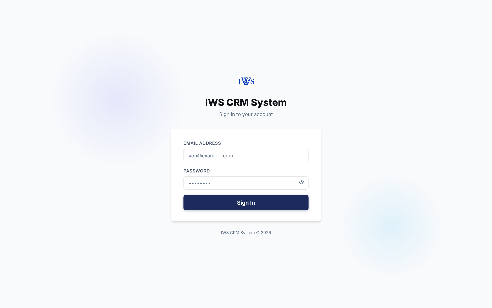

### 3.2 Step-by-Step Login Instructions
1. Enter your corporate email address into the **Email Address** field.
2. Enter your secure password into the **Password** field. Click the eye icon to toggle password visibility if needed.
3. Click **Sign In**.
4. Upon authentication, you will be automatically redirected to your role-specific dashboard view.

> [!TIP]
> **Demo / Testing Credentials**:
> - **Admin**: `dhruv@iwsfinserve.com` / `admin123`
> - **Manager**: `anish@iwsfinserve.com` / `manager123`
> - **Sales Rep**: `rahul@iwsfinserve.com` / `rahul123`

---

## 4. Executive Dashboard & Real-Time KPIs

The Dashboard serves as the command center for monitoring pipeline health, lead velocity, and daily tasks.

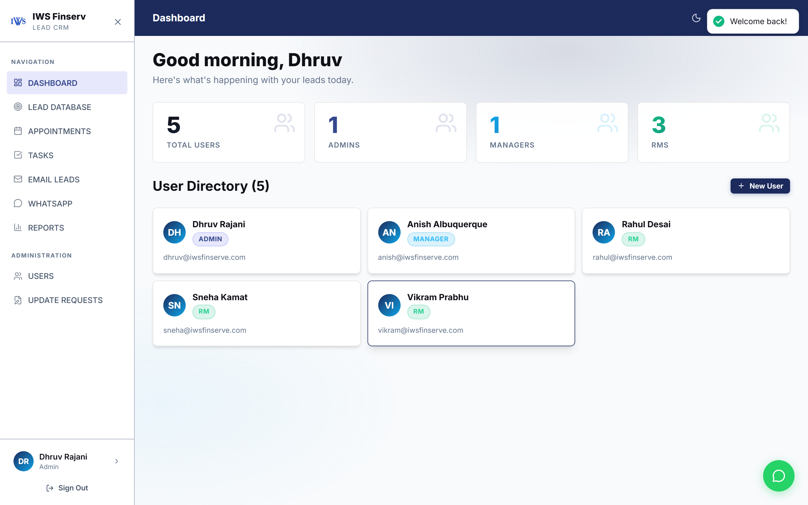

### Dashboard Components:
1. **Metric Cards (Top Row)**:
   - **Total Leads**: Cumulative count of leads across all sources.
   - **Active Leads**: Leads currently undergoing active outreach and discovery.
   - **Conversion Rate**: Percentage of processed leads successfully converted to clients.
   - **Won / Investor Value**: Total booked revenue or assets under management (AUM).
2. **Conversion Funnel**: Visual representation of lead progression from initial intake down to closed investor.
3. **Recent Activity Feed**: Real-time audit log of notes logged, appointments scheduled, and status changes.
4. **Notification Bell**: Located in the top navigation bar, highlighting overdue follow-ups, pending approvals, and upcoming meetings.

---

## 5. Lead Management Pipeline (Core CRM)

### 5.1 All Leads Table & Filter Toolbar
The **Leads** screen (`/leads`) provides a unified, searchable grid of all potential and active clients.

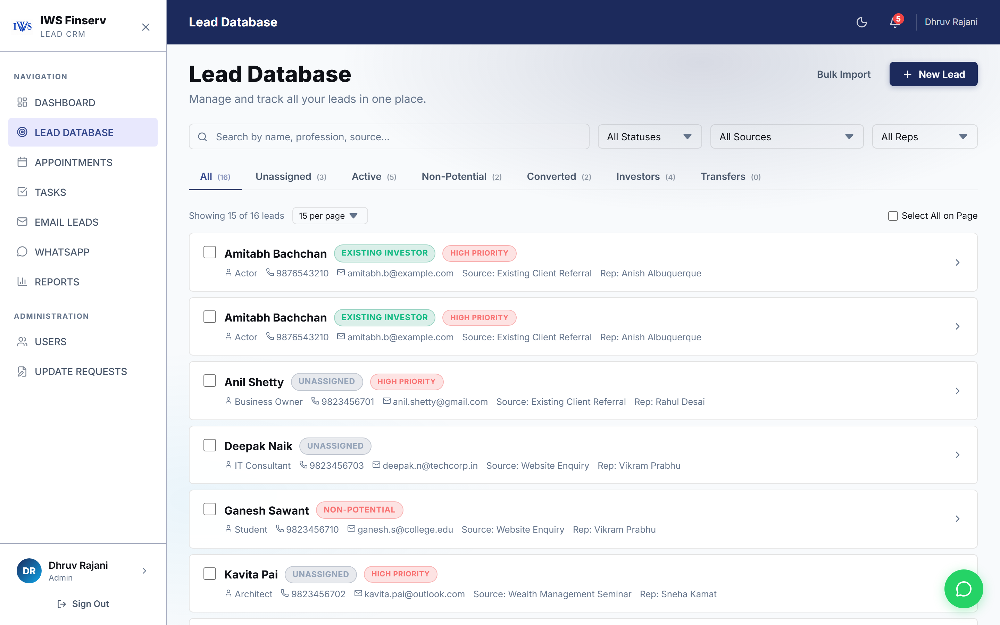

#### How to Filter and Search Leads:
- **Instant Search**: Type any client name, phone number, email, or profession into the search box for immediate instant filtering.
- **Pipeline Tabs**: Click tabs along the top to filter by stage:
  - `All`: Entire accessible lead database.
  - `My Clients`: Leads specifically assigned to you.
  - `Unassigned`: Fresh leads available for immediate claiming.
  - `Active`: Leads in discussion or proposal stage.
  - `Converted / Investors`: Successfully closed clients.
  - `Transfers`: Pending transfer requests.
- **Source & Rep Dropdowns**: Filter down to specific acquisition channels (e.g., *Website Enquiry*, *Seminar*, *Partner Referral*) or specific sales reps.

---

### 5.2 Creating a New Lead
Click the **+ New Lead** button in the top-right corner to open the intake dialog.

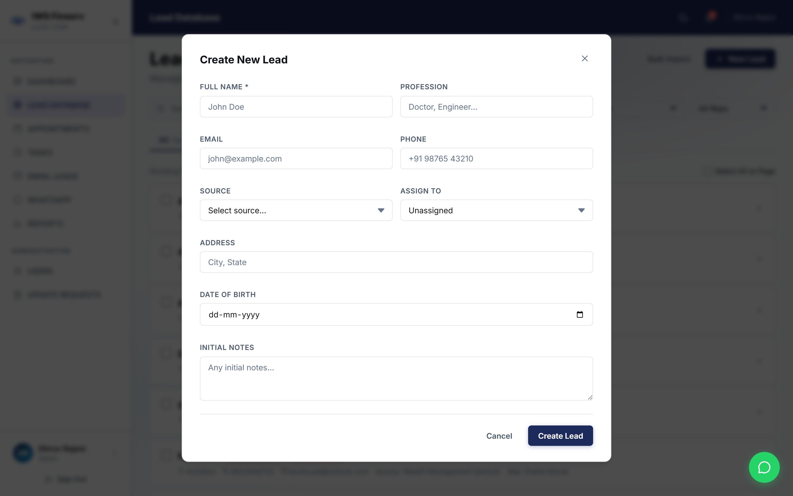

#### Form Fields Guide:
1. **Full Name** *(Required)*: Client's primary contact name.
2. **Phone Number** *(Required)*: Direct contact number (formatted with country code, e.g. `+91 98200 11223`).
3. **Email Address**: Business or personal email address.
4. **Profession / Designation**: Job title and company details (helps AI compute investment capacity).
5. **Lead Source**: Channel through which the lead originated.
6. **Priority**: Choose between `Low`, `Medium`, or `High`.
7. **Initial Notes**: Any background information or referral context.
8. Click **Create Lead** to immediately add the lead to the pipeline.

---

### 5.3 360° Lead Details & Interaction Timeline
Click on any lead record from the table to open the comprehensive **Lead Details** page (`/leads/:id`).

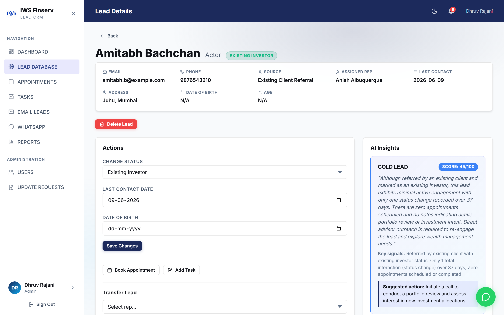

#### Key Sections:
- **Client Identity Header**: Name, current pipeline badge, priority badge, and assigned sales representative.
- **Quick Action Bar**: One-click shortcuts to **Call**, **Send WhatsApp**, **Schedule Appointment**, or **Add Task**.
- **Contact & Demographics**: Phone number, email, address, age, and profession.
- **Interaction Timeline**: Chronological history of every interaction, note, appointment outcome, and system event.
- **Note Logging Box**: Add call summaries, client preferences, and next steps.

---

### 5.4 Lead Update Request Workflow
To preserve reporting integrity, sales representatives submit an **Update Request** when advancing a lead to stages like *Potential*, *Converted*, or *Non-Potential*.

#### How to Submit an Update Request:
1. On the Lead Details page, click **Request Status Change**.
2. Select the target status and provide brief justification notes (e.g., *"Client completed KYC and invested ₹10L in growth fund"*).
3. Click **Submit Request**.
4. The request instantly alerts Managers and Admins in the **Lead Update Requests** queue. Once approved, the status updates across all reports automatically.

---

### 5.5 CSV Export & Bulk Operations
- **Export to CSV**: Click **Export CSV** on the leads page to download a filtered spreadsheet of lead contact details, acquisition sources, and timestamps.
- **Bulk Assign (Managers/Admins)**: Select multiple leads using the checkboxes on the left and click **Bulk Assign** to distribute leads evenly across sales reps.

---

## 6. Gemini AI Intelligence Suite

Each lead profile features built-in **Gemini AI Intelligence** to help sales reps prioritize outreach and close faster.


### What the AI Engine Delivers:
1. **AI Lead Quality Score (0–100)**: Computed based on lead source credibility, profession, communication responsiveness, and investment profile.
2. **Win Probability %**: Predictive likelihood of closing the deal based on historical sales patterns.
3. **Recommended Next Action**: Prescriptive suggestion (e.g., *"Schedule an in-person portfolio review before Friday"*).
4. **Optimal Contact Timing**: Best day and hour to call or message the client to maximize response rates.
5. **Smart Talking Points**: Tailored conversation starters based on the client's financial profile.

---

## 7. Omnichannel Communications (WhatsApp & Email)

### 7.1 Dedicated WhatsApp Inbox
Navigate to **WhatsApp Inbox** (`/chats`) in the sidebar for full-screen customer messaging.

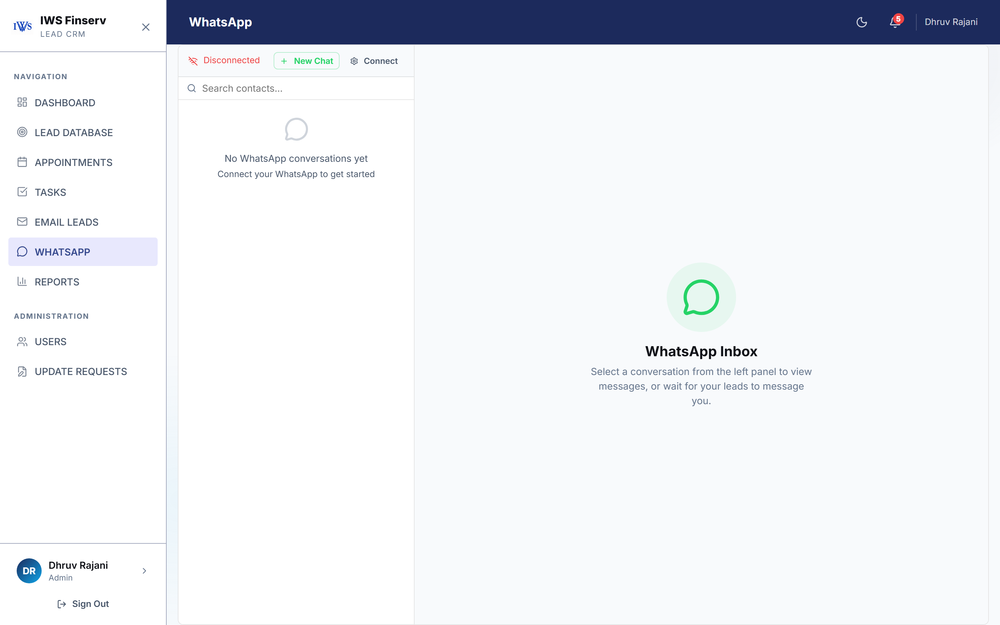

#### Features:
- **Live Conversation Threads**: Real-time sync with Evolution API.
- **Pre-Approved Message Templates**: Send greeting messages, appointment reminders, and follow-up templates in one click.
- **Attachment Support**: Send portfolio brochures, mutual fund fact sheets, and documents directly through chat.

---

### 7.2 Floating WhatsApp Quick Widget
Access customer chats without navigating away from your active page using the persistent floating WhatsApp button in the bottom right corner.

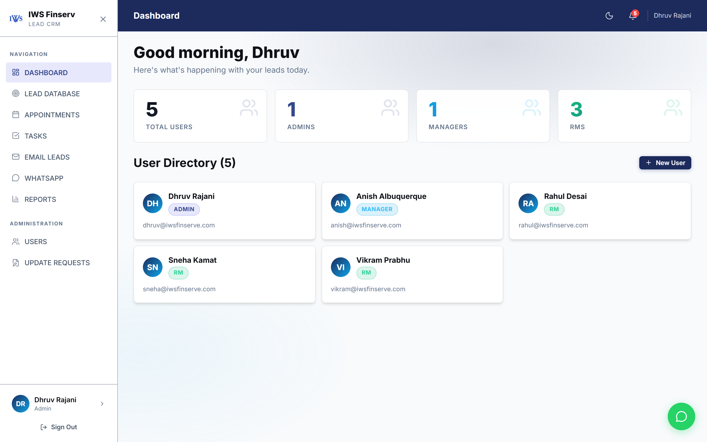

---

### 7.3 Email Leads Management
The **Email Leads** screen (`/emails`) aggregates incoming email inquiries and automated form submissions.

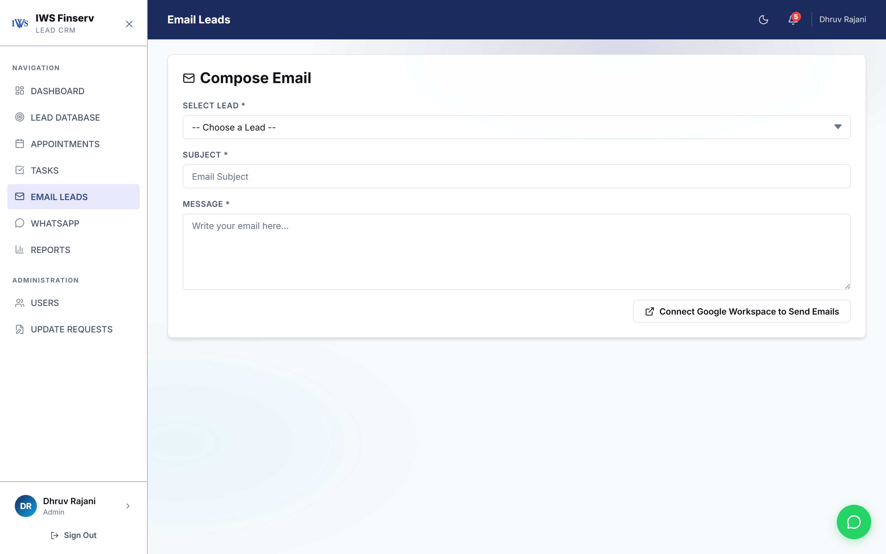

---

## 8. Appointments & Google Calendar Synchronization

### 8.1 Calendar & List Views
The **Appointments** screen (`/appointments`) helps reps organize and track client meetings.

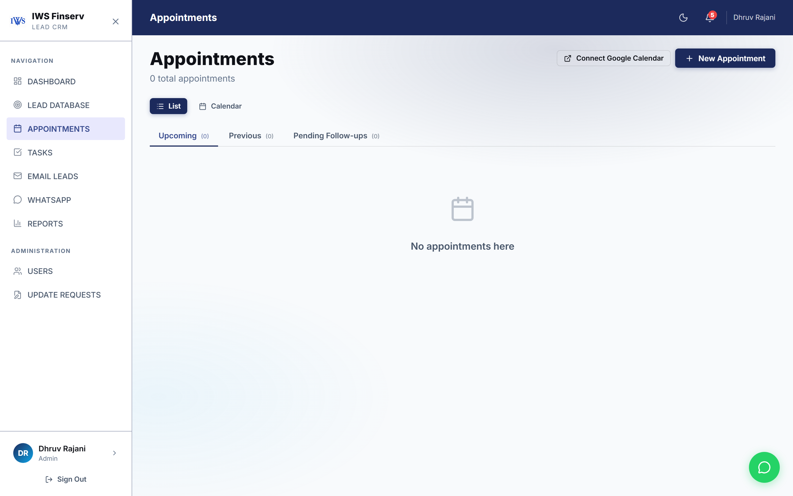

- **View Modes**: Switch seamlessly between a structured **List View** and an interactive **Calendar Grid**.
- **Filter Tabs**: Toggle between `Upcoming`, `Previous`, and `Pending Follow-ups`.

---

### 8.2 Scheduling New Appointments
Click **+ New Appointment** to open the scheduling modal.

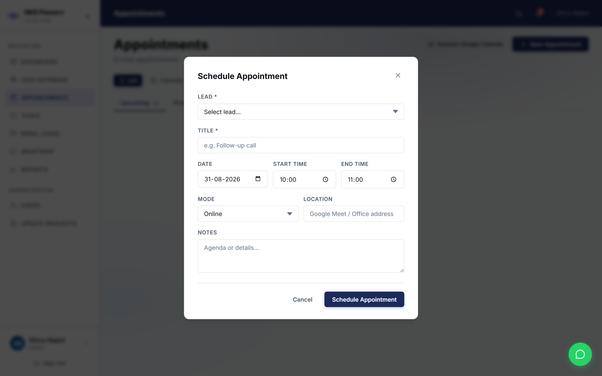

#### Step-by-Step Scheduling:
1. **Lead Selection**: Search and select the client.
2. **Meeting Title**: Enter a descriptive topic (e.g., *"Retirement Planning Consultation"*).
3. **Meeting Mode**:
   - 🌐 **Online / Video Call** (Generates Google Meet link)
   - 🏢 **In-Person Meeting** (Enter meeting address / branch)
   - 📞 **Phone Consultation**
4. **Date & Start Time**: Pick date and time slot.
5. Click **Schedule Appointment**.

---

### 8.3 Google Calendar 2-Way Sync
Connect your corporate Google account with one click using the **Connect Google Calendar** button.
- Appointments created in the CRM automatically appear on your Google Calendar on your phone and laptop.
- External invites and reschedules reflect back into the CRM automatically.

---

## 9. Task Management & Due Date Extensions

The **Tasks** module (`/tasks`) tracks action items, document collection, and follow-up reminders.

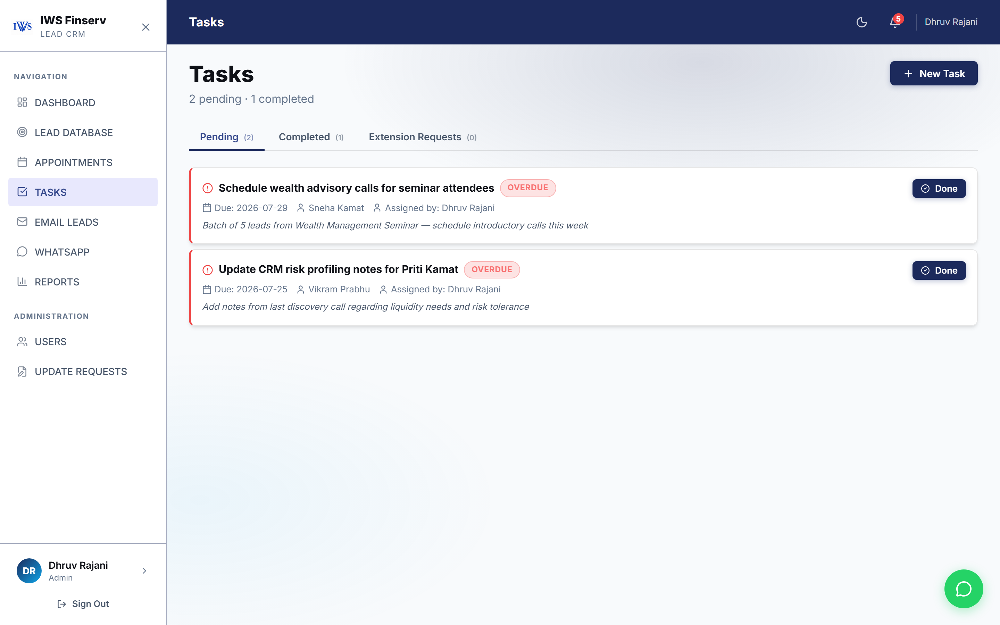

### Key Features:
- **Priority Visuals**: Tasks are color-coded by urgency (`Urgent`, `High`, `Medium`, `Low`).
- **Overdue Detection**: Overdue tasks automatically trigger a red alert badge and in-app notification.
- **Due Date Extension**: If a client asks to be contacted next week, click **Request Due Date Extension** to propose a new deadline.

---

## 10. Manager Governance & Team Oversight

### 10.1 My Team Dashboard
Accessible to Managers and Admins via `/my-team`, this view provides real-time workload visibility across all direct reports.

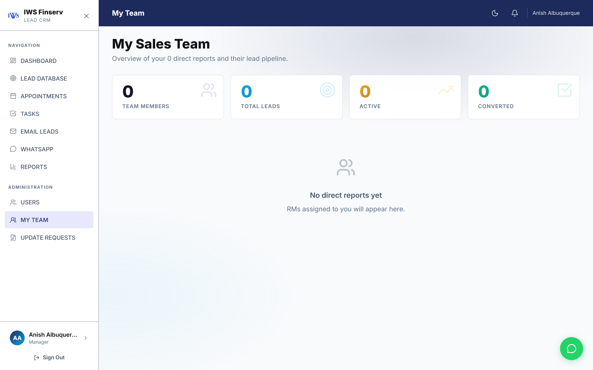

#### Manager Metrics:
- Total leads assigned per sales rep.
- Conversion velocity and stage breakdown.
- Active vs. dormant client distribution.

---

### 10.2 Lead Update Requests Queue
The **Lead Update Requests** page (`/lead-update-requests`) displays all pending status change requests submitted by sales representatives.

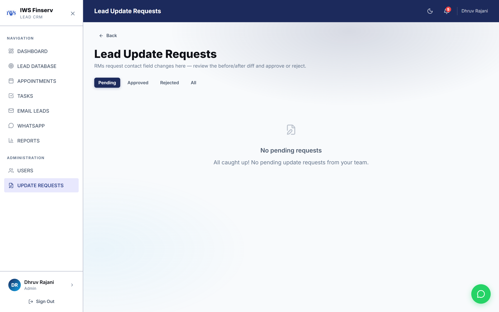

- **Approve**: Instantly commits the stage change and recalculates pipeline metrics.
- **Reject**: Reverts the change and sends feedback to the submitting representative.

---

### 10.3 Lead Transfers & Reassignments
Managers can reassign leads when team members go on leave or when specialized advisory is required. Simply open any lead, click **Transfer Lead**, select the new representative, and confirm.

---

## 11. Reports & Performance Analytics

The **Reports** section (`/reports`) delivers actionable insights into channel ROI, team performance, and conversion bottlenecks.

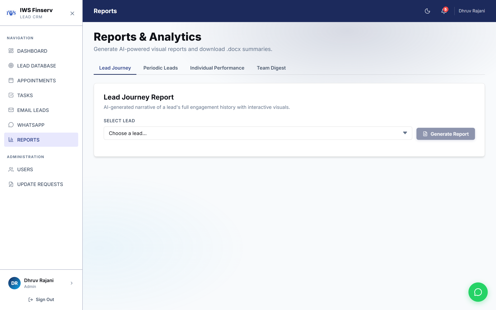

### Key Report Types:
1. **Pipeline Stage Distribution**: Visual breakdown of leads from new to closed.
2. **Source Performance**: Comparison of acquisition channels (Referrals vs. Seminar vs. Website).
3. **Rep Performance Leaderboard**: Conversion percentage and total AUM generated per rep.
4. **Executive Document Downloads**: Download structured `.docx` executive summary briefs and raw datasets in one click.

---

## 12. System Administration (Admin Only)

System Administrators have access to the **Users** management interface (`/users`).

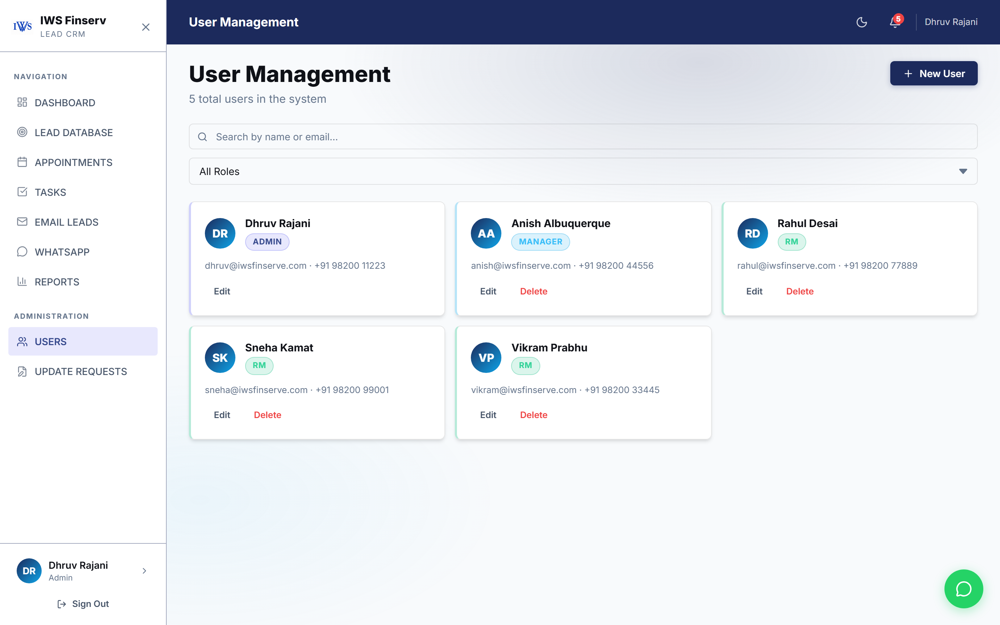

### Administrative Capabilities:
- **Add New Team Member**: Create user accounts with custom roles (`admin`, `manager`, `sales_rep`).
- **Edit User Profile**: Update contact details, manager hierarchy, and active status.
- **Password Reset**: Securely trigger password updates.
- **Deactivate Accounts**: Immediately revoke system access while preserving historical client timelines.

---

## 13. Troubleshooting & FAQs

### Q1: Why can't I directly change a lead's status to "Converted"?
> **A**: To maintain auditable sales records, Sales Representatives submit an **Update Request**. A Sales Manager or Admin reviews and approves the update with one click.

### Q2: How do I reconnect my Google Calendar if sync stops?
> **A**: Navigate to `/appointments`, click **Disconnect**, and then click **Connect Google Calendar** to re-authorize your Google Workspace account.

### Q3: What should I do if WhatsApp messages are not sending?
> **A**: Ensure your WhatsApp Web session is active in the Evolution Gateway settings, and verify the client's phone number includes the proper international country code (e.g. `+91`).

### Q4: How do I export my own assigned clients to Excel/CSV?
> **A**: Go to `/leads`, click the **My Clients** tab, and click the **Export CSV** button in the upper right.

---

## 14. Sales Rep Daily Best Practice Checklist

Follow this **15-Minute Daily Routine** for optimal sales conversion:

```markdown
- [ ] 09:00 AM — Review Notification Bell for upcoming appointments and overdue tasks.
- [ ] 09:15 AM — Check the 'Unassigned' tab in Leads and claim high-priority incoming leads.
- [ ] 10:00 AM — Review Gemini AI Insights on today's target leads before dialing.
- [ ] 01:00 PM — Log all call outcomes and timeline notes immediately after client calls.
- [ ] 03:00 PM — Send follow-up WhatsApp templates directly from the lead profile.
- [ ] 05:30 PM — Check the Tasks tab and mark completed items or request date extensions.
```

---

*© 2026 IWS Lead Management System. All rights reserved. For technical assistance or enterprise support, contact your system administrator.*
